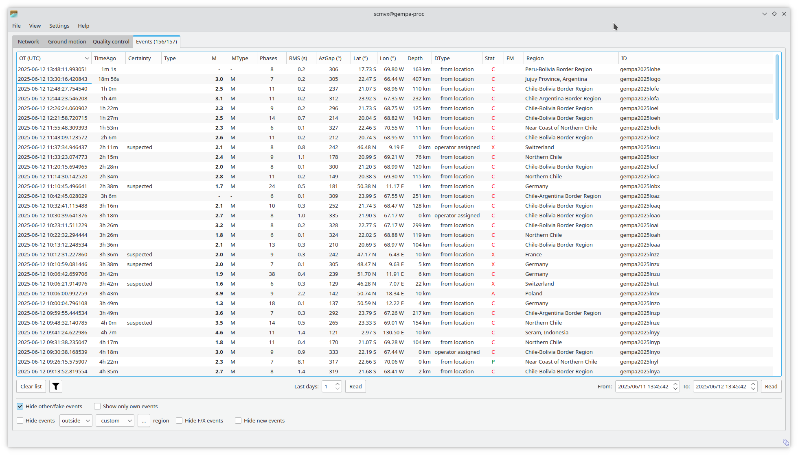
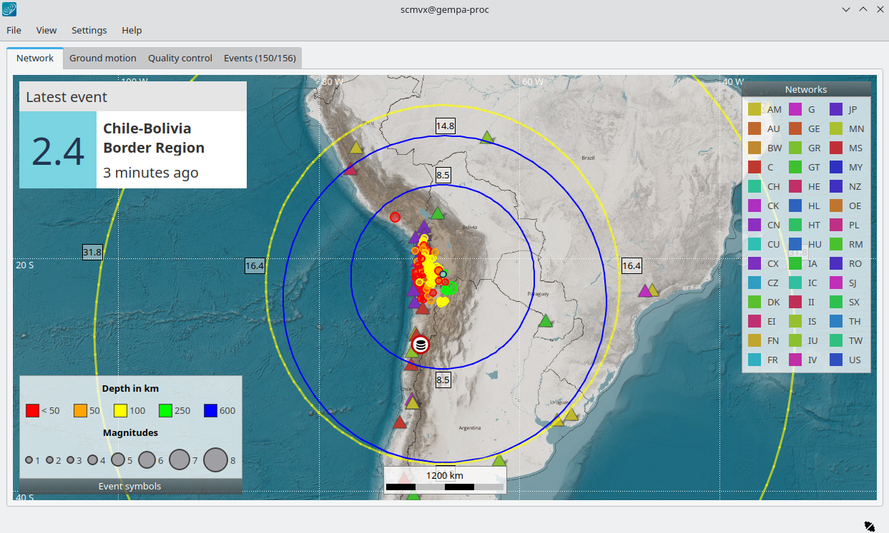
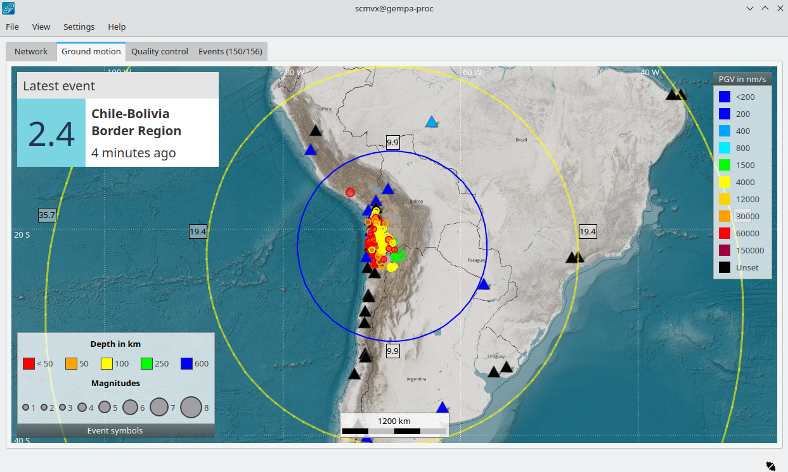
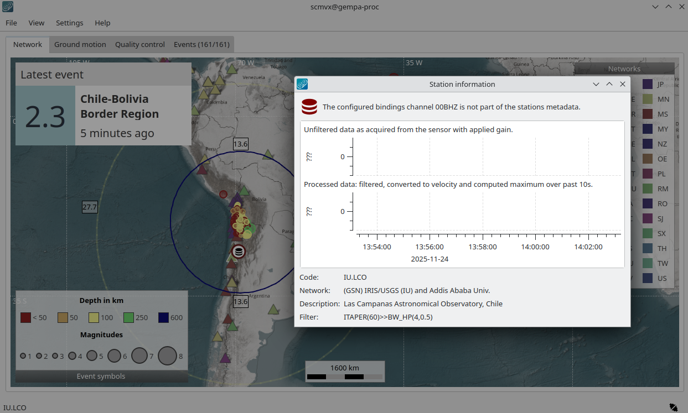
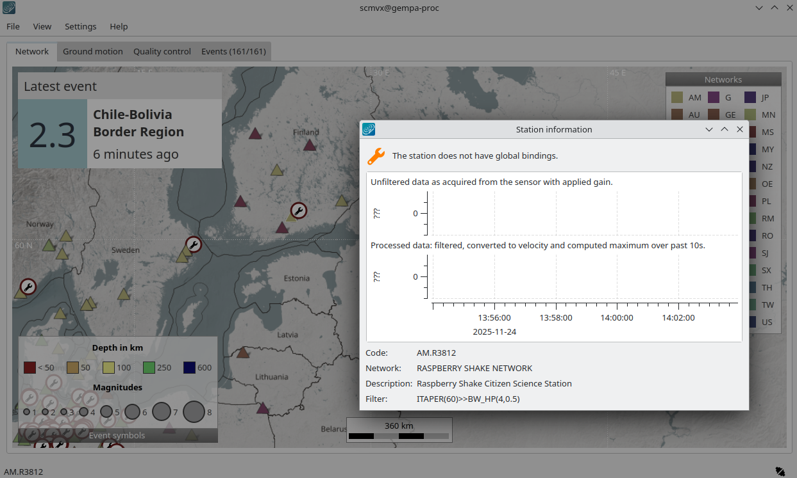
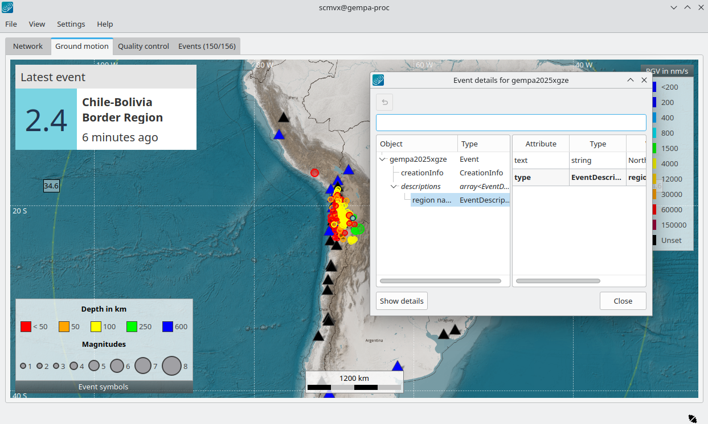
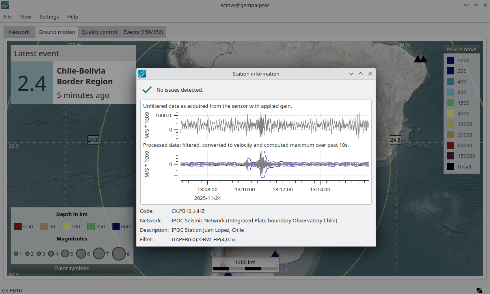

.. raw:: html

   

   Events tab

   Network tab

   Ground motion tab

.. figure:: media/scmvx-tabs-qc.png
   :alt: scmvx quality control tab

   Quality control tab

.. raw:: html

   

scmvx (SeisComP map view extended) provides maps that visualize information of
stations, :term:`events<Events>` and phase picks at stations. Events are
received and updated in real time or loaded from a |scname| database. Stations
are loaded from inventory independent of bindings but compared with bindings.
Station information include:

* Location (not sensor location) along with network, station and full
  stream code. The latter is defined by global bindings.
* Current ground motion.
* Current station quality.
* Current trigger status.
* Instantaneous waveforms.
* Station inventory and bindings configuration issues.

The maps can be customized by global :confval:`scheme.map` parameters and
additional layers can be added as outlined in the
:ref:`GUI documentation <global_gui>`.

:program:`scmvx` shows all information in tabes which are outlined in section
:ref:`sec-scmvx-tabs`. More applications and use cases are described in section
:ref:`sec-scmvx-use-cases`.

.. note::

   scmvx is the next generation of :ref:`scmv` which is deprecated but shipped
   along with the |scname| package for maintaining backwards compatibility.

.. _sec-scmvx-tabs:

Tabs
====

scmvx provides multiple :ref:`tabs <sec-scmvx-tabs>` for visualizing stations
along with station parameters or issues and for showing events updated in
real time or read from the |scname| database:

* :ref:`Network <sec-scmvx-network-tab>`: Map showing events and network
  information including station configuration and inventory issues.
* :ref:`Ground motion <sec-scmvx-gm-tab>`: Map with events and stations. The
  color of stations symbols represents recent ground motion calculated by scmvx
  in a configurable time window.
* :ref:`Quality control <sec-scmvx-qc-tab>`: Map with events and stations. The
  color of stations symbols represents recent waveform quality control
  parameters calculated by :ref:`scqc`.
* :ref:`Events <sec-scmvx-events-tab>`: Event list updated in real time and
  allowing to filter events and to load historic events from database.

Stations with recent phase picks are blinking with red triangles.
When a new event arrives, the details are shown and updated in the latest event
field. Yellow and blue circles indicate the predicted wavefronts of P and S
phases, respectively. The wavefronts fade out and disappear depending on
magnitude.

Any tab can be shown in full-screen mode (:kbd:`F11`) where it is detached
from the main window and shown without any frame.

.. note::

   The following figures show maps which are optimized for file size (134 MByte)
   and coloring and made available by :cite:t:`gempa`:

   .. code-block:: sh

      cd Downloads
      wget -O /tmp/maps.tar "https://data.gempa.de/packages/Public/maps/gempa-minimal/gempa-minimal.tar"
      cd $SEISCOMP_ROOT/..
      tar -xvf /tmp/maps.tar
      rm /tmp/maps.tar

   You may add the maps to your global configuration
   (:file:`$SEISCOMP_ROOT/etc/global.cfg`):

   .. code-block:: properties

      map.location = @DATADIR@/maps/world%s.png
      map.format = mercator

.. _sec-scmvx-network-tab:

Network
-------

The network tab shows all stations available with the loaded inventory.
Station symbols (triangles) and event (circles) are color-coded according to
network code and source depth, respectively. Activate the legend (right-click
on map) for the color-coding. Stations having issues in global bindings or
inventory are highlighted by error symbols.

.. _fig-scmvx-network-tab:

   Network tab showing stations and events. Two events were received
   recently. The yellow and blue circles indicate the predicted wavefronts of
   P and S phases, respectively, with their degrees of epicentral distance shown
   next to the circles.

Clicking on a station opens the details view showing stations details and
waveforms. Issues are explained.

.. _fig-scmvx-network-tab-issue:

   Network tab explaining a conflict of a station binding configuration with
   loaded inventory. Click on the corresponding station symbol for opening the
   details view.

.. _fig-scmvx-network-tab-issue-no-gb:

   Network tab indicating a station with missing global bindings.

.. _sec-scmvx-gm-tab:

Ground motion
-------------

The ground motion tab shows the current ground motion situation at a station.
Station symbols (triangles) and event (circles) are color-coded according to
recent ground motion and source depth, respectively.

.. _fig-scmvx-gm-tab:

   Ground motion tab with stations (triangles) and events.

.. _fig-scmvx-gm-tab-event:

   Ground motion tab. Clicking on an event symbol (circle) opens the object
   inspector in which the event details can be read.

.. _fig-scmvx-gm-tab-event:

   Ground motion tab. Clicking on a station symbol (triangle) opens the details
   view in which station details and waveforms can be read.

.. _sec-scmvx-qc-tab:

Quality control
---------------

The quality control tab shows current waveform QC parameters as computed by
:ref:`scqc` which must be running for showing the values.

.. _fig-scmvx-qc-tab:

.. figure:: media/scmvx-tabs-qc.png
   :width: 16cm
   :align: center

   Quality control (QC) tab. The QC parameter type may be selected in the View
   menu. Here, the maps are greyed out interactively (:kbd:`G`).

.. _sec-scmvx-events-tab:

Events
------

Events are shown as they arrive in real time and may be interactively loaded
from database and filtered thereafter in the Events tab.
During startup events from within a period of time are loaded and shown
according the configuration of :confval:`readEventsNotOlderThan`.
More events are added in real time as they arrive.
Historic events can be loaded from database for time spans and other filter
criteria.
The loaded events can be sorted interactively by clicking on the table header.
Events out of scope can be hidden based on region, event type or agency ID.
In contrast to other event lists, e.g. in :ref:`scolv` or :ref:`scesv`, this
event list only gives access to parameter of the preferred but no other origins
of events.

.. _fig-scmvx-events-tab:

   Events tab with events loaded from database and updated in real time.

Hotkeys
-------

.. csv-table::
   :header: Hotkey, Description
   :widths: 30,70
   :delim: ;

   C; Center map around latest event upon event update
   G; Show map base layer in gray scale
   N; Reset view to default
   :kbd:`F1`              ;Open SeisComP documentation in default browser
   :kbd:`Shift + F1`      ;Open scmvx documentation in default browser
   :kbd:`F2`              ;Open dialog for connecting to database and messaging
   :kbd:`F6`              ;Toggle latest event information on map
   :kbd:`F7`              ;Toggle legend
   :kbd:`F8`              ;Toggle station issues in Network tab
   :kbd:`F9`              ;Toggle station annotation
   :kbd:`F10`             ;Switch to event list (Events tab)
   :kbd:`F11`             ;Toggle full screen mode
   :kbd:`CTRL + F`        ;Search station
   :kbd:`CTRL + O`        ;Open event parameter XML file
   :kbd:`CTRL + Q`        ;Quit scmvx
   :kbd:`left`, :kbd:`right`, :kbd:`up`, :kbd:`down` ;Move focus of map left, right, up, down
   Double mouse click     ;Center map
   Mouse wheel            ;Zoom in or out in map
   :kbd:`+`               ;Zoom in into map around current center
   :kbd:`-`               ;Zoom out in map around current center
   :kbd:`Shift` + Hold left mouse button + Drag ;Select a map area and zoom into it
   Right mouse button     ;Open context menu

.. _sec-scmvx-use-cases:

Use Cases
=========

Identify networks
-----------------

Application:

* Identify a network on map.

Procedure:

#. Navigate to the :ref:`Network tab<sec-scmvx-network-tab>`.
#. Activate the legend: Right-click on map, select *Show legend(s)*.
#. Identify all stations by the color of the corresponding network.

Search stations
---------------

Application:

* Identify a station on map.

Procedure:

#. Press :kbd:`CTRL + F` to open the search window.
#. Type any string from a station and/or network name in the input field or just
   select a station from the list.
#. Double click in a station in the list to center the map at this location.

Get station information, detail issues
--------------------------------------

Application:

* Read station information.
* Identify and read station inventory and bindings configuration issues (in
  :ref:`Network tab<sec-scmvx-network-tab>`).
* View instantaneous waveforms.

Procedure:

#. Navigate to the :ref:`Network tab<sec-scmvx-network-tab>`.
#. Position the mouse above a triangle representing a station. The selected
   station is highlighted. Zoom in if stations are overlapping.
#. Click your left mouse button for opening the station info widget.
   Data and potential configuration issues are shown.

Search for and show an event
----------------------------

Application:

* Browse event catalogs in |scname| database.
* Search the list of loaded events.

Procedure:

#. Navigate to the :ref:`Events tab<sec-scmvx-events-tab>` load events from
   database in a relevant time range. You may narrow down the database search
   through the filter button. After events are loaded the list may be limited by
   hiding irrelevant events and you may change the sorting of the event table by
   clicking on the header.
#. Identify the event and double-click on the event line to load the parameters.
   You will immediately switch to a map centered around the selected event.

Get event information
---------------------

Application:

* View event details.
* Send origin information to other applications, e.g., :ref:`scolv` for further
  processing.

Procedure:

#. Position the mouse above a circle representing the location of an event.
   Zoom in if events are overlapping.
#. Click the left mouse button for opening the event object inspector.
#. Click on **Show details** for sending the origin to the messaging for further
   processing, e.g., by :ref:`scolv`.

Set artificial origin
---------------------

Application:

* Identify an event of interest, e.g., by blinking stations.
* Send origin information to other applications, e.g. :ref:`scolv` for further
  processing from scratch.

Procedure:

#. Position the mouse in the map.
#. Press the middle mouse button.
#. Set date & time and latitude, longitude & depth.
#. Press "Create" to open the origin in another GUI, e.g., :ref:`scolv` which
   must be running already.

Command-Line Examples
=====================

* Real-time view of events and stations on a local server

  .. code-block:: properties

     scmvx -H localhost -I slink://localhost --debug

* Offline view of event parameters given in an XML file. Inventory is read from
  database.

  .. code-block:: properties

     scmvx -d localhost -i events.xml --debug
